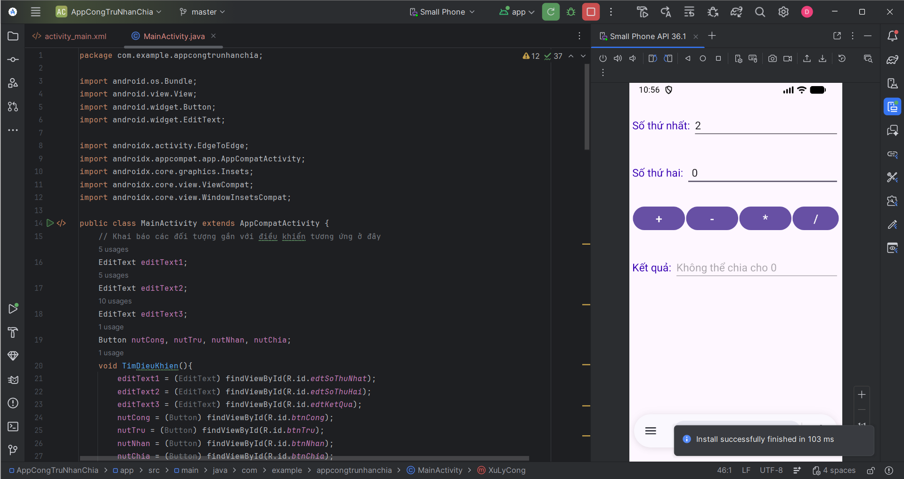
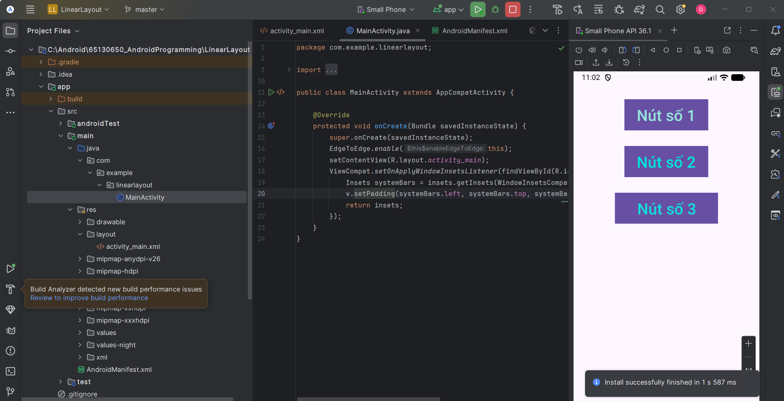
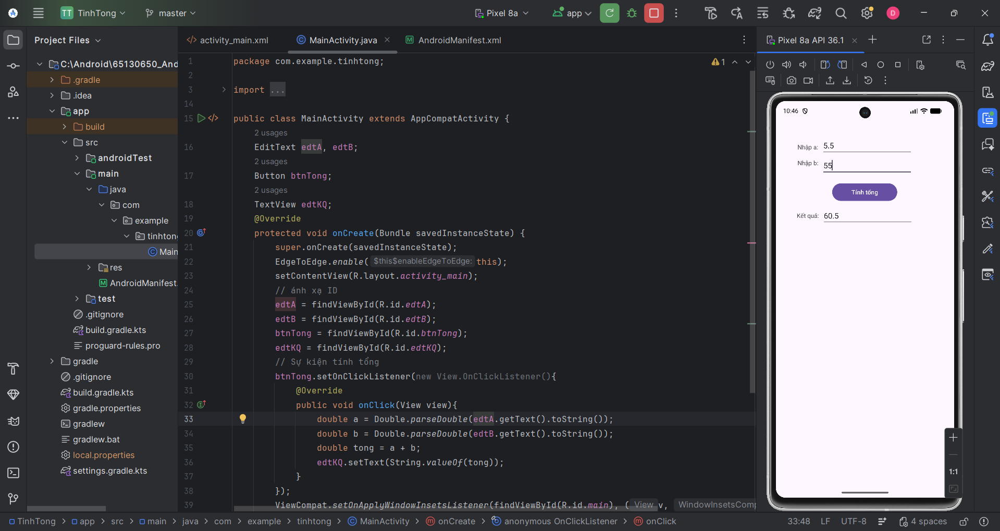
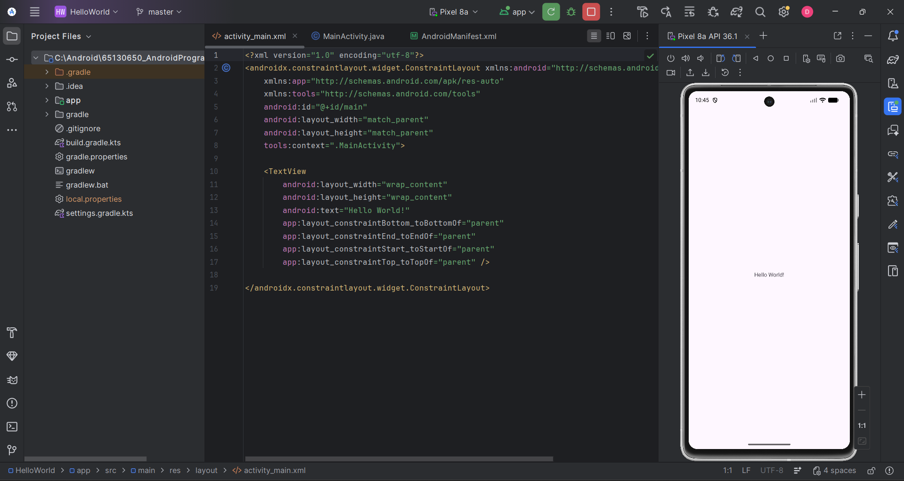

# Lập Trình Thiết Bị Di Động - 65130650

### Install:
---
*   **Android Studio** (Hedgehog or newer recommended)
*   **Android 7.0 (Nougat API 24)** or higher
*   **Java SE Development Kit (JDK 11)**

*Mô tả*
## Đây là kho lưu trữ bài tập khi tôi làm bài tập lớn và nhỏ, đây là lưu trữ tham khảo, không phải dự án lâu dài hoặc có thể sử dụng.

---
*Quá trình thực hiện bài tập*

### Bài tập 4: App Tính Cộng Trừ Nhân Chia (AppCongTruNhanChia)
[Chi tiết bài tập](./AppCongTruNhanChia/app/src/main/java/com/example/appcongtrunhanchia/MainActivity.java)

*Ứng dụng thực hiện các phép tính cơ bản giữa hai số nhập từ người dùng.*

---

### Bài tập 3: Giao diện LinearLayout (LinearLayout)
[Chi tiết bài tập](./LinearLayout/app/src/main/java/com/example/linearlayout/MainActivity.java)

*Thực hành thiết kế giao diện sử dụng LinearLayout với các thuộc tính cơ bản.*

---

### Bài tập 2: Tính Tổng (TinhTong)
[Chi tiết bài tập](./TinhTong/app/src/main/java/com/example/tinhtong/MainActivity.java)

*Ứng dụng nhập hai số và hiển thị kết quả tổng của chúng.*

---

### Bài tập 1: Hello World
[Chi tiết bài tập](./HelloWorld/app/src/main/java/com/example/helloworld/MainActivity.java)

*Ứng dụng Android đầu tiên hiển thị thông điệp "Hello World!".*

---

## Hướng dẫn sử dụng
1. Mở **Android Studio**.
2. Chọn **Open** và dẫn đến thư mục của từng bài tập cụ thể.
3. Chờ Gradle đồng bộ và nhấn **Run** để chạy trên thiết bị.
