# Lập trình thiết bị di động - 65130650

### Install:
---
*   **Android Studio** (Hedgehog or newer recommended)
*   **Android 7.0 (Nougat API 24)** or higher
*   **Java SE Development Kit (JDK 11)**

*Mô tả*
## Đây là kho lưu trữ bài tập khi tôi làm bài tập lớn và nhỏ, đây là lưu trữ tham khảo, không phải dự án lâu dài hoặc có thể sử dụng.

---
*Quá trình thực hiện bài tập*

### Bài tập 12: Fragment Tĩnh (FragmentEx_Statically)
[Chi tiết bài tập](./FragmentEx_Statically/app/src/main/java/tmnduy/ntu/fragmentex_statically/MainActivity.java)

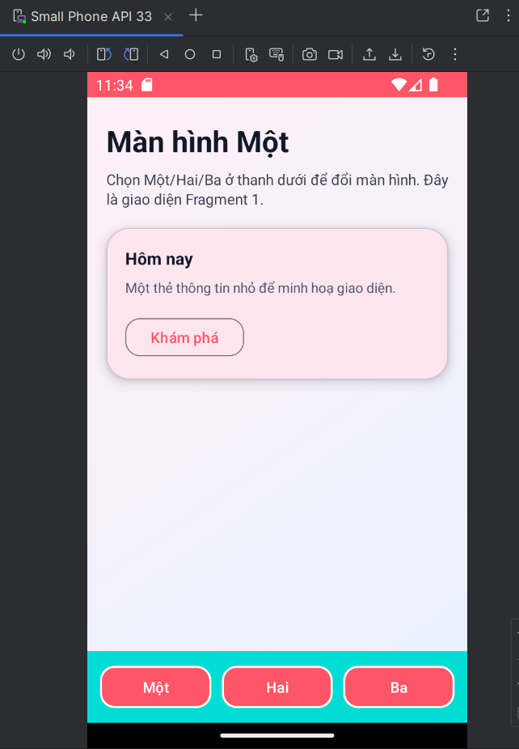 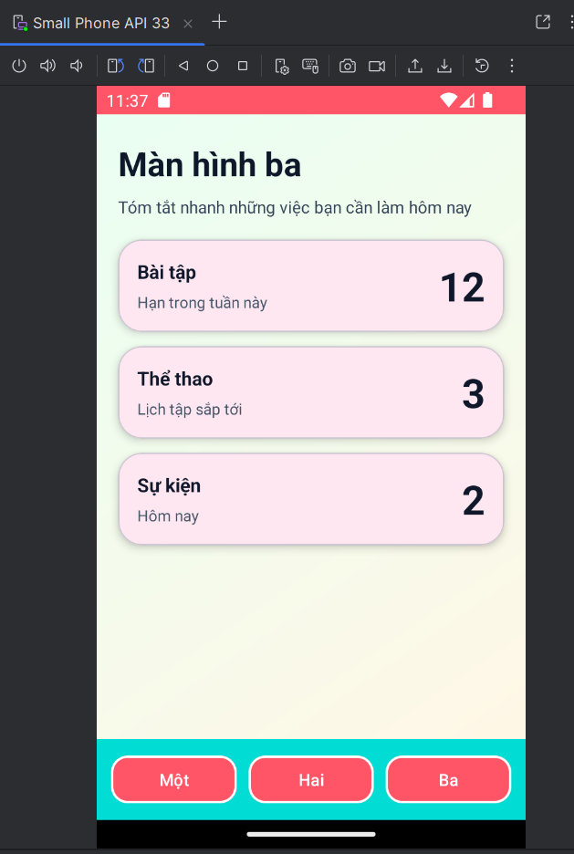 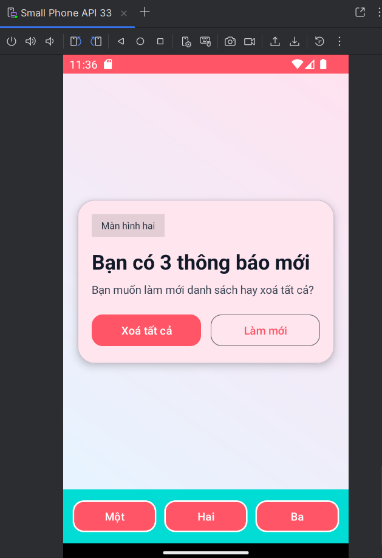

*Thực hành chia giao diện người dùng thành các phần độc lập (Fragment) và nhúng chúng trực tiếp vào Layout XML.*

---

### Bài tập 11: Đọc báo tổng hợp (DocBaoTongHop)
[Chi tiết bài tập](./DocBaoTongHop/app/src/main/java/tmnduy/ntu/docbaotonghop/MainActivity.java)

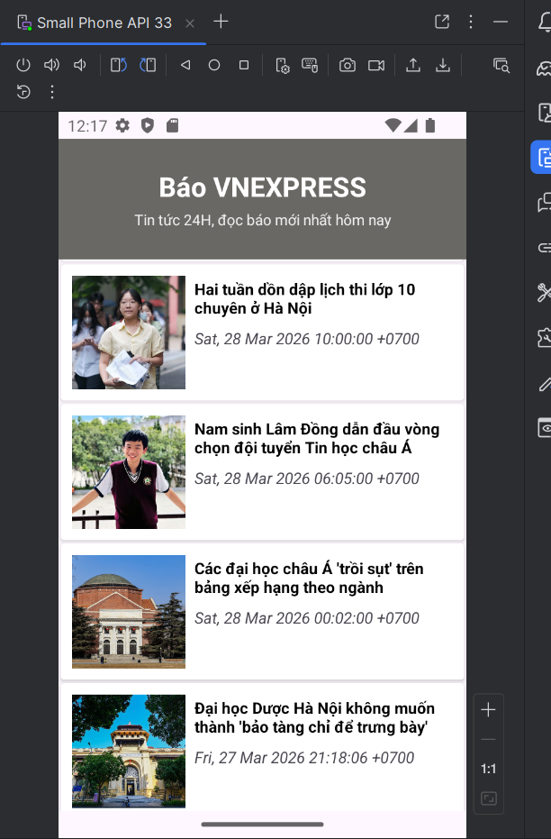

*Ứng dụng đọc báo tổng hợp từ các nguồn RSS, hiển thị danh sách tin tức và xem nội dung chi tiết.*

---

### Bài tập 10: Sử dụng RecyclerView (UsingRecyclerView)
[Chi tiết bài tập](./UsingRecyclerView/app/src/main/java/tmnduy/ntu/usingrecyclerview/MainActivity.java)

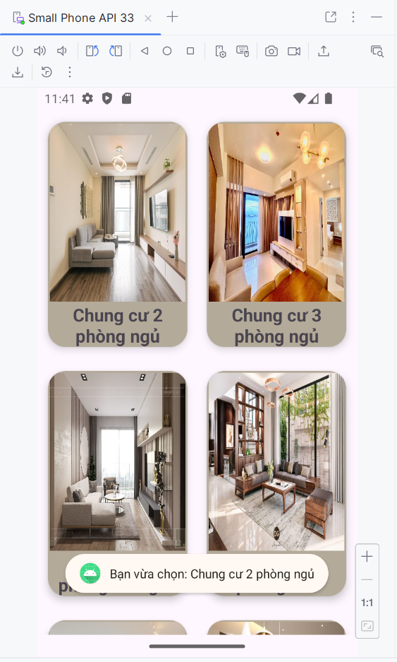 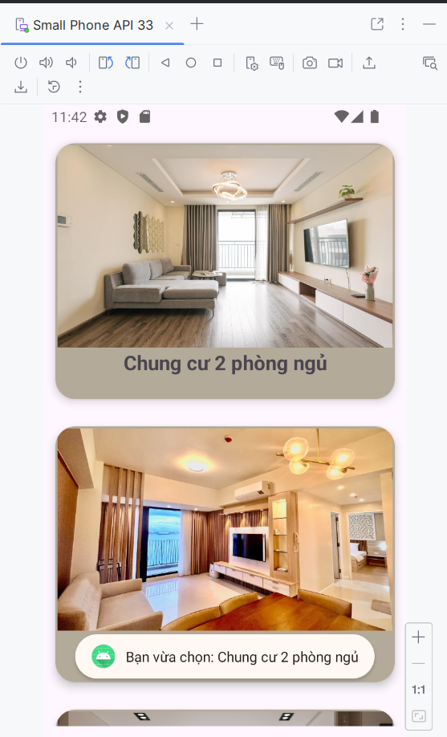 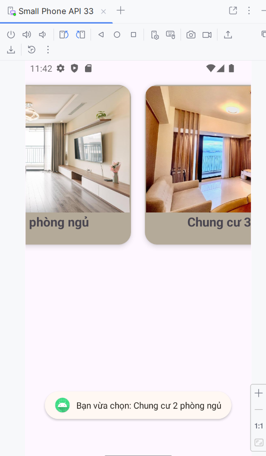

*Sử dụng RecyclerView để hiển thị danh sách dữ liệu tối ưu và linh hoạt hơn so với ListView.*

---

### Bài tập 9: Danh sách Món Ăn (AppMonAn)
[Chi tiết bài tập](./AppMonAn/app/src/main/java/tmnduy/ntu/appmonan/MainActivity.java)

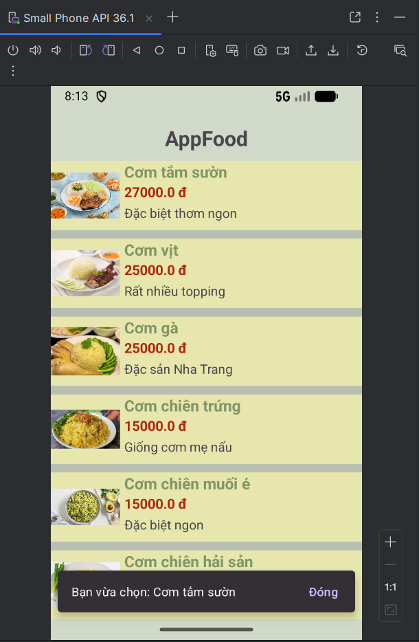

*Ứng dụng danh sách các loại món ăn với khả năng xem chi tiết thông tin từng món.*

---

### Bài tập 8: Danh sách Vật Liệu (DanhSachVatLieu)
[Chi tiết bài tập](./DanhSachVatLieu/app/src/main/java/tmnduy/ntu/danhsachvatlieu/MainActivity.java)

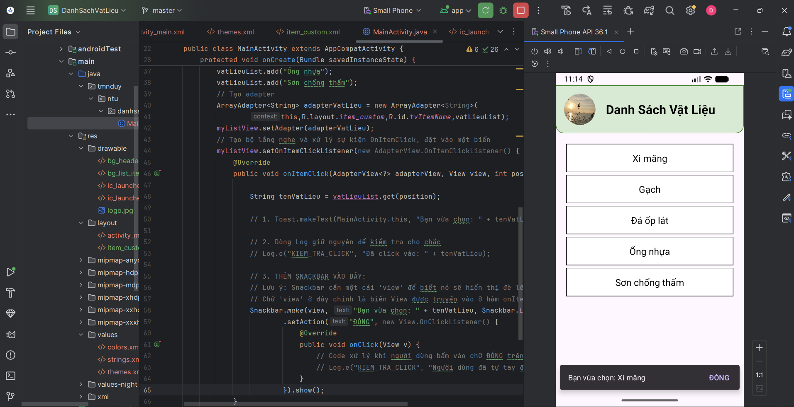
*Sử dụng ListView để hiển thị danh sách các loại vật liệu xây dựng.*

---

### Bài tập 7: Danh sách Tỉnh Thành (DanhSachTinhThanh)
[Chi tiết bài tập](./DanhSachTinhThanh/app/src/main/java/tmnduy/ntu/danhsachtinhthanh/MainActivity.java)

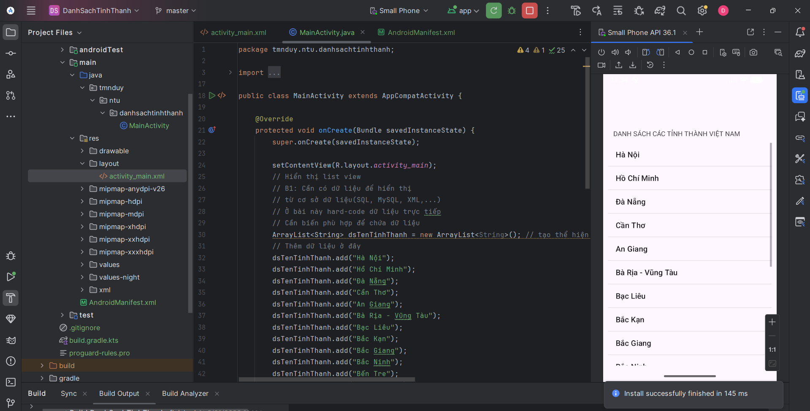
*Sử dụng ListView để hiển thị danh sách các tỉnh thành Việt Nam.*

---

### Bài tập 6: Máy tính Calculator (Calculator)
[Chi tiết bài tập](./Calculator/app/src/main/java/com/example/calculator/MainActivity.java)

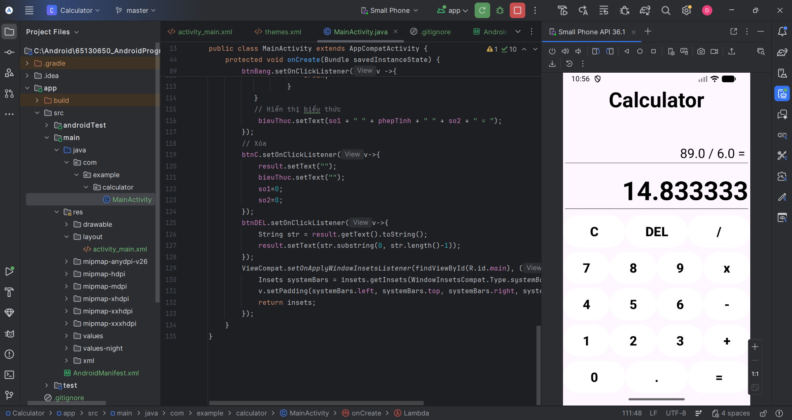
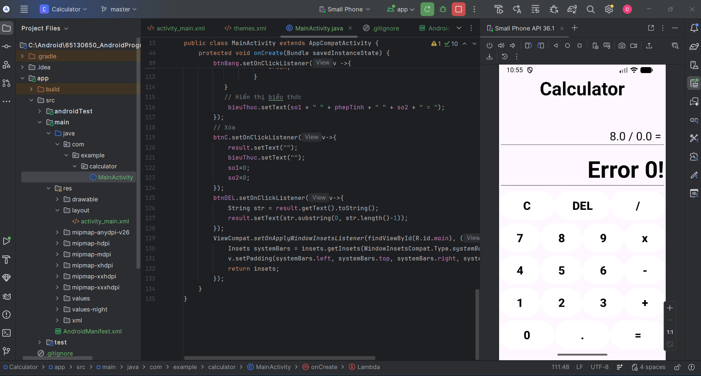
*Ứng dụng máy tính bỏ túi với giao diện đầy đủ các phím số và phép tính nâng cao.*

---

### Bài tập 5: App Tính Chỉ số khối cơ thể (BMI_app)
[Chi tiết bài tập](./BMI_app/app/src/main/java/com/example/bmi_app/MainActivity.java)

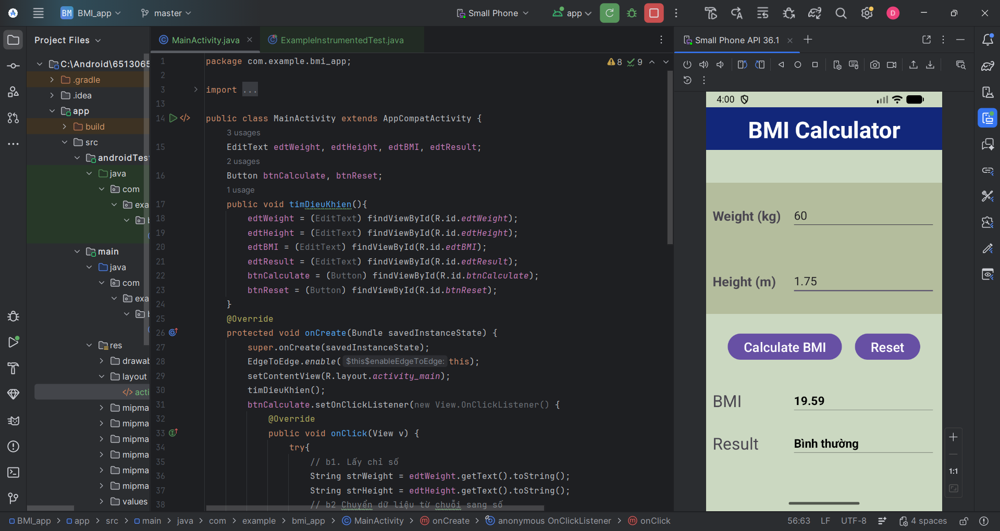
*Ứng dụng tính toán chỉ số BMI dựa trên chiều cao và cân nặng của người dùng.*

---

### Bài tập 4: App Tính Cộng Trừ Nhân Chia (AppCongTruNhanChia)
[Chi tiết bài tập](./AppCongTruNhanChia/app/src/main/java/com/example/appcongtrunhanchia/MainActivity.java)

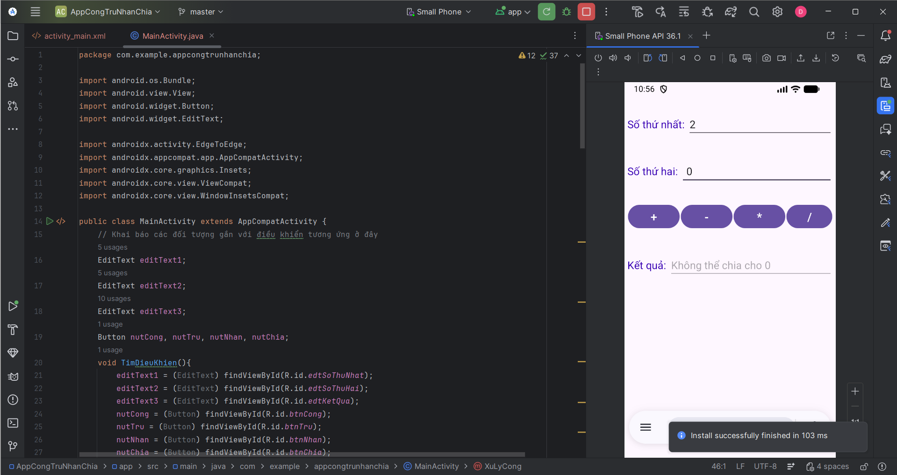
*Ứng dụng thực hiện các phép tính cơ bản giữa hai số nhập từ người dùng.*

---

### Bài tập 3: Giao diện LinearLayout (LinearLayout)
[Chi tiết bài tập](./LinearLayout/app/src/main/java/com/example/linearlayout/MainActivity.java)

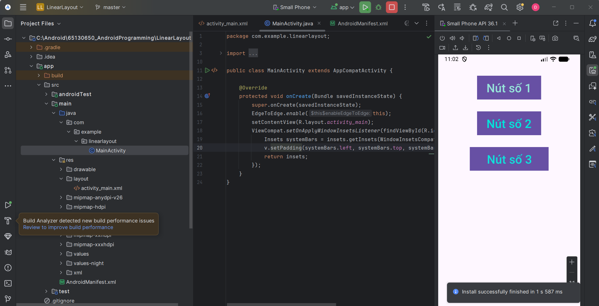
*Thực hành thiết kế giao diện sử dụng LinearLayout với các thuộc tính cơ bản.*

---

### Bài tập 2: Tính Tổng (TinhTong)
[Chi tiết bài tập](./TinhTong/app/src/main/java/com/example/tinhtong/MainActivity.java)

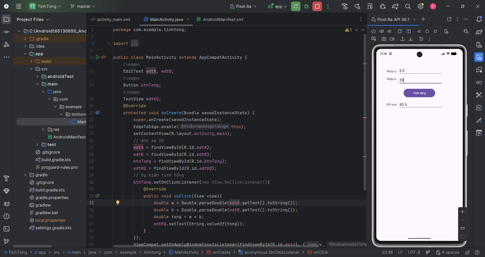
*Ứng dụng nhập hai số và hiển thị kết quả tổng của chúng.*

---

### Bài tập 1: Hello World
[Chi tiết bài tập](./HelloWorld/app/src/main/java/com/example/helloworld/MainActivity.java)

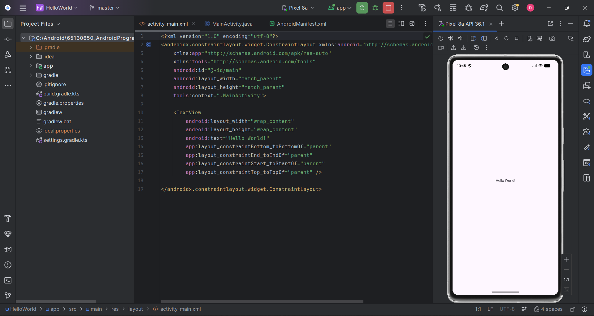
*Ứng dụng Android đầu tiên hiển thị thông điệp "Hello World!".*

---

## Hướng dẫn sử dụng
1. Mở **Android Studio**.
2. Chọn **Open** và dẫn đến thư mục của từng bài tập cụ thể.
3. Chờ Gradle đồng bộ và nhấn **Run** để chạy trên thiết bị.
