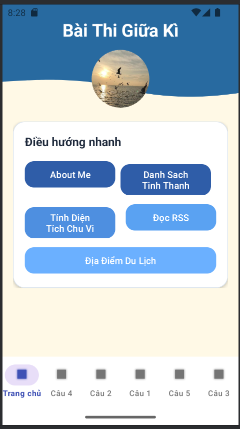
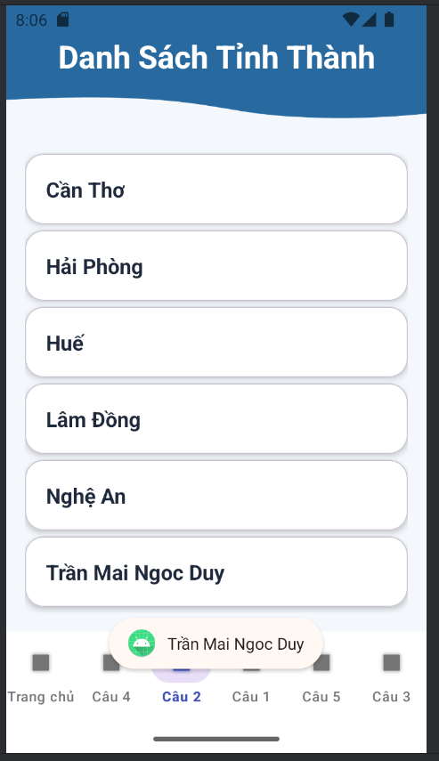
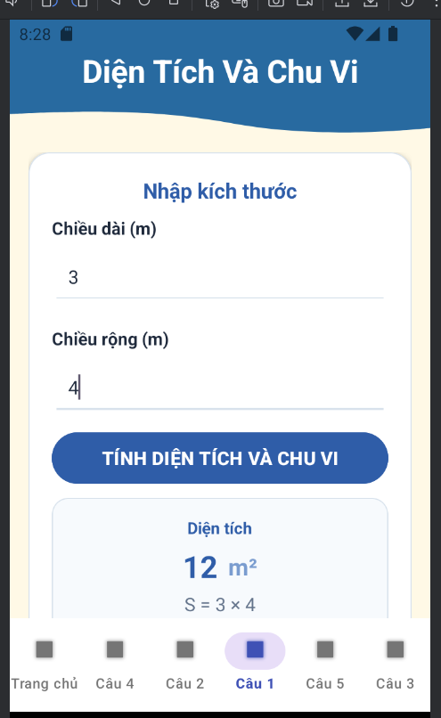
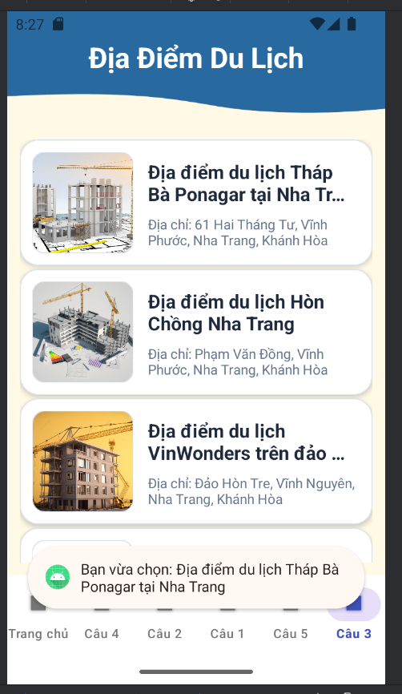

# Bài thi giữa kì - 65130650

### Cài đặt
---
* **Android Studio** (khuyến nghị Hedgehog hoặc mới hơn)
* **Android 7.0 (Nougat API 24)** hoặc cao hơn
* **Java SE Development Kit (JDK 11)**

### Mô tả
---
Đây là bài thi giữa kì của mình trên Android, xây dựng theo mô hình `BottomNavigationView` kết hợp `Fragment`. Ứng dụng gồm một màn hình trang chủ và các chức năng con:
* Giới thiệu thông tin cá nhân
* Danh sách tỉnh thành
* Tính diện tích hình chữ nhật
* Đọc tin tức RSS từ VnExpress
* Danh sách địa điểm du lịch

---
## Quá trình thực hiện bài tập

### Trang chủ
[Chi tiết bài tập](./app/src/main/java/thigk2/tranmaingocduy/tranmaingocduy65130650thigk/MainActivity.java)

*Màn hình trang chủ đóng vai trò điều hướng nhanh đến các chức năng chính của ứng dụng.*

---

### Câu 4: Giới thiệu bản thân
[Chi tiết bài tập](./app/src/main/java/thigk2/tranmaingocduy/tranmaingocduy65130650thigk/Cau1Fragment.java)

*Hiển thị hồ sơ cá nhân, thông tin liên hệ và liên kết GitHub của sinh viên.*

---

### Câu 2: Danh sách tỉnh thành
[Chi tiết bài tập](./app/src/main/java/thigk2/tranmaingocduy/tranmaingocduy65130650thigk/Cau2Fragment.java)

*Sử dụng `RecyclerView` để hiển thị danh sách các tỉnh thành Việt Nam theo dạng thẻ.*

---

### Câu 1: Tính diện tích và chu vi
[Chi tiết bài tập](./app/src/main/java/thigk2/tranmaingocduy/tranmaingocduy65130650thigk/Cau3Fragment.java)

*Nhập chiều dài và chiều rộng để tính diện tích hình chữ nhật, đồng thời hiển thị công thức tính.*

---

### Câu 5: Địa điểm du lịch
[Chi tiết bài tập](./app/src/main/java/thigk2/tranmaingocduy/tranmaingocduy65130650thigk/Cau5Fragment.java)

*Danh sách các địa điểm du lịch tại Nha Trang được hiển thị bằng `RecyclerView` kèm hình ảnh và địa chỉ.*

---

### Câu 3: Tin tức RSS
[Chi tiết bài tập](./app/src/main/java/thigk2/tranmaingocduy/tranmaingocduy65130650thigk/Cau4Fragment.java)

*Ứng dụng đọc RSS từ VnExpress, hiển thị danh sách tin tức và cho phép mở bài báo chi tiết khi chọn một mục.*

---

## Hướng dẫn sử dụng
1. Mở **Android Studio**.
2. Chọn **Open** và trỏ đến thư mục `TranMaiNgocDuy65130650Thigk`.
3. Chờ Gradle đồng bộ hoàn tất.
4. Nhấn **Run** để chạy ứng dụng trên thiết bị hoặc máy ảo.

---
## Công nghệ sử dụng
* `BottomNavigationView`
* `Fragment`
* `RecyclerView`
* `RSS parsing`
* `Glide`

